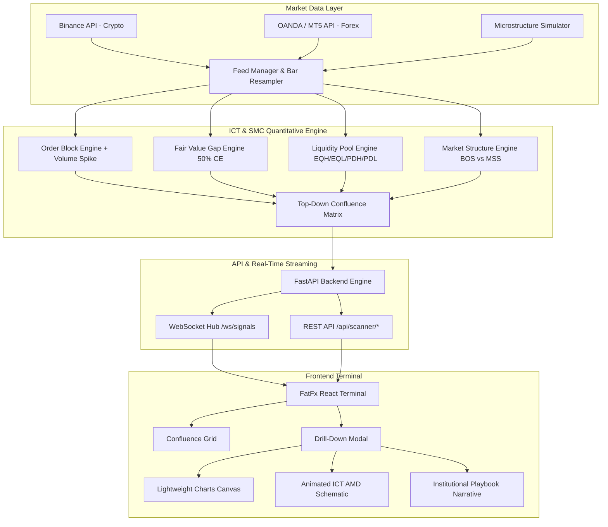

# FatFx — Ultra-Accurate Forex & Crypto ICT/SMC Market Scanner

**FatFx** is an institutional quantitative market scanner and trading terminal engineered purely on **Inner Circle Trader (ICT)** and **Smart Money Concepts (SMC)** across **14 precise timeframes**:
`1m, 5m, 10m, 15m, 30m, 45m, 1h, 2h, 4h, 1d, 3d, 1w, 2w, 1M`.

---

## 🏛️ System Architecture



---

## ⚡ Key Features

1. **Ultra-Accurate ICT/SMC Algorithmic Engines**:
   - **Order Blocks (OB)**: Detects the true institutional pivot candle prior to displacement, normalized with ATR and volume ratios, tracking subsequent mitigation.
   - **Fair Value Gaps (FVG)**: Strict 3-candle imbalance detection with exact Consequent Encroachment (50% CE) price calculation.
   - **Liquidity Pools**: Clusters Equal Highs (EQH - BSL) and Equal Lows (EQL - SSL) within pip tolerance, tracking Previous Day High/Low (PDH/PDL) and session sweeps.
   - **BOS vs MSS**: Distinguishes between trend continuation (BOS) and energetic displacement body closes (MSS).

2. **Top-Down Narrative Matrix & Confluence Scoring (0 - 100%)**:
   - HTF Context (1D / 4H / 1H) orderflow bias.
   - LTF Execution (1m / 5m / 15m) Market Structure Shift & FVG retest.
   - Enforces **Minimum 1:2.5 Risk-to-Reward Ratio**.

3. **Interactive Institutional Terminal**:
   - **TradingView Lightweight Charts**: Dynamic plotting of candlesticks, Order Block equilibrium lines, FVG zones, and Entry / SL / TP targets.
   - **Animated ICT Schematic**: Visualizes the institutional Accumulation -> Manipulation Judas Swing -> Distribution Expansion (AMD) cycle.
   - **5-Stage Step-by-Step Institutional Narrative**: Clear human-readable trade thesis.
   - **Asset & Broker Switcher**: Toggle between Forex and Crypto, filter by Binance, Bybit, Coinbase, OANDA, IC Markets, Pepperstone, and MT5.

---

## 🚀 Quickstart Guide

### 1. Backend Setup (FastAPI & Quantitative Engine)

```bash
cd backend
python -m venv venv
# Windows:
venv\Scripts\activate
# Linux/macOS:
source venv/bin/activate

pip install -r requirements.txt
python -m uvicorn backend.main:app --host 0.0.0.0 --port 8000 --reload
```

Backend endpoints:
- Swagger Docs: `http://localhost:8000/docs`
- Health Check: `http://localhost:8000/api/health`
- WebSocket Feed: `ws://localhost:8000/ws/signals`

### 2. Frontend Setup (React & Tailwind Terminal)

```bash
cd frontend
npm install
npm run dev
```

The FatFx Terminal will be live at `http://localhost:3000`.

---

## 🧪 Running Unit Tests

```bash
cd backend
pytest tests/
```
